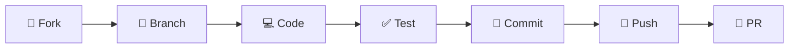

<div align="center">

# 🚀 MAD Year 4 S1 Version 2


<p align="center">
  
  
  
  
</p>

<p align="center">
  
  
  
  
</p>

<p align="center">
  <b>A beautiful, modern task management app built with Flutter</b><br>
  <sub>Featuring stunning gradient UI, smooth animations, and intuitive user experience</sub>
</p>

<br>


</div>

---

## ✨ Features

<details open>
<summary><b>🎨 Modern UI Components</b></summary>

- 🌈 **Gradient Backgrounds** - Beautiful purple-to-blue gradients throughout
- 💳 **Card-Based Design** - Clean, modern card layouts with subtle shadows
- 🎭 **Glassmorphism Effects** - Translucent elements with blur effects
- 📱 **Responsive Design** - Optimized for all screen sizes
- ⚡ **Smooth Animations** - Fluid transitions and micro-interactions

</details>

<details open>
<summary><b>🔐 Authentication System</b></summary>

- 🔑 **Secure Login** - Static authentication with validation
- 📝 **User Registration** - Complete sign-up flow with form validation
- 🚫 **Route Protection** - Prevents unauthorized access
- 🔒 **Session Management** - Proper login/logout flow

</details>

<details open>
<summary><b>📊 Dashboard & Analytics</b></summary>

- 📈 **Task Statistics** - Visual progress tracking
- 📋 **Task Management** - Create, read, update, delete tasks
- ⭐ **Favorites System** - Save and organize favorite content
- 🔔 **Smart Notifications** - Categorized notification system
- 👤 **User Profile** - Comprehensive profile management

</details>

<details open>
<summary><b>🎯 Navigation & UX</b></summary>

- 🧭 **Bottom Navigation** - Smooth tab switching with state preservation
- 🔄 **State Management** - Efficient state handling across screens
- 🎪 **Interactive Elements** - Touch feedback and visual responses
- 📱 **Native Feel** - Platform-optimized components

</details>

---

## 🖼️ Screenshots

<div align="center">

### 🌟 Splash & Authentication


### 📱 Main Application


</div>

---

## 🛠️ Tech Stack

<div align="center">

| Category             | Technology                                                                                      |
| -------------------- | ----------------------------------------------------------------------------------------------- |
| **Framework**        |  |
| **Language**         |           |
| **Architecture**     |         |
| **State Management** |                             |
| **UI/UX**            |               |
| **Navigation**       |         |

</div>

---

## 🚀 Getting Started

### 📋 Prerequisites

Before you begin, ensure you have the following installed:

- **Flutter SDK** (>=3.0.0)
- **Dart SDK** (>=3.0.0)
- **Android Studio** or **VS Code**
- **Git**

### ⚡ Quick Setup

```bash
# Clone the repository
git clone https://github.com/yourusername/mad_year4_s1_version2.git

# Navigate to project directory
cd mad_year4_s1_version2

# Install dependencies
flutter pub get

# Run the app
flutter run
```

### 🔧 Detailed Installation

<details>
<summary>Click to expand detailed installation steps</summary>

1. **Clone the Repository**
   ```bash
   git clone https://github.com/yourusername/mad_year4_s1_version2.git
   cd mad_year4_s1_version2
   ```

2. **Install Dependencies**
   ```bash
   flutter pub get
   ```

3. **Configure Environment**
   ```bash
   # Check Flutter installation
   flutter doctor
   
   # Ensure all dependencies are satisfied
   flutter doctor --android-licenses
   ```

4. **Run the Application**
   ```bash
   # Debug mode
   flutter run
   
   # Release mode
   flutter run --release
   
   # Specific platform
   flutter run -d android
   flutter run -d ios
   ```

</details>

---

## 🎮 Usage

### 🔐 Demo Credentials

For testing the application, use these credentials:

```
📧 Email: sopheap2025@gmail.com
🔑 Password: Admin1234
```

### 🎯 Navigation Flow

1. **Launch** → Splash Screen with app branding
2. **Authentication** → Login or Register
3. **Dashboard** → Main home screen with statistics
4. **Explore** → Navigate through bottom tabs:
   - 🏠 **Home** - Task dashboard and insights
   - ⭐ **Favorites** - Saved content and bookmarks
   - 🔔 **Notifications** - Updates and alerts
   - 👤 **About** - Profile and app information

---

## 📁 Project Structure

```
lib/
├── 🎯 app/
│   └── routes/
│       └── route.dart
├── 📱 screens/
│   ├── splash_screen.dart
│   ├── login_screen.dart
│   ├── register_screen.dart
│   ├── main_screen.dart
│   ├── home_screen.dart
│   ├── favorite_screen.dart
│   ├── notification_screen.dart
│   └── about_screen.dart
└── 🚀 main.dart
```

---

## 🎨 Design System

### 🌈 Color Palette

<div align="center">

| Color                                                             | Hex       | Usage                           |
| ----------------------------------------------------------------- | --------- | ------------------------------- |
|    | `#667eea` | Primary actions, focus states   |
|  | `#764ba2` | Gradient endings, accents       |
|    | `#48bb78` | Success states, completed items |
|    | `#ed8936` | Warnings, pending items         |
|      | `#e53e3e` | Errors, critical actions        |

</div>

### 🎭 Typography

- **Headers**: Inter, Bold (24-32px)
- **Body**: Inter, Regular (14-16px)
- **Captions**: Inter, Medium (12px)

---

## 🤝 Contributing

We welcome contributions! Here's how you can help:

<div align="center">



</div>

### 📝 Contribution Steps

1. **Fork** the repository
2. **Create** a feature branch (`git checkout -b feature/amazing-feature`)
3. **Commit** your changes (`git commit -m 'Add amazing feature'`)
4. **Push** to the branch (`git push origin feature/amazing-feature`)
5. **Open** a Pull Request

### 🎯 Contribution Guidelines

- Follow the existing code style
- Write meaningful commit messages
- Add tests for new features
- Update documentation as needed
- Ensure all tests pass

---

## 📜 License

<div align="center">

This project is licensed under the **MIT License** - see the [LICENSE](LICENSE) file for details.

```
MIT License

Copyright (c) 2025 SOPHEAP OM

Permission is hereby granted, free of charge, to any person obtaining a copy
of this software and associated documentation files (the "Software"), to deal
in the Software without restriction, including without limitation the rights
to use, copy, modify, merge, publish, distribute, sublicense, and/or sell
copies of the Software, and to permit persons to whom the Software is
furnished to do so, subject to the following conditions:

The above copyright notice and this permission notice shall be included in all
copies or substantial portions of the Software.
```

</div>

---

## 👥 Team

<div align="center">

<table>
  <tr>
    <td align="center">
      <br>
      <sub><b>Mr. Sopheap Om</b></sub><br>
      <sub>Lead Developer</sub>
    </td>
    <td align="center">
      <br>
      <sub><b>MAD Year 4 Team</b></sub><br>
      <sub>Contributors</sub>
    </td>
  </tr>
</table>

</div>

---

## 📞 Contact & Support

<div align="center">

<p>
  <a href="mailto:sopheap.it.developer@gmail.com">
    
  </a>
</p>

<p>
  <a href="https://github.com/sopheap-it/mad_year4_s1_version2">
    
  </a>
</p>

---

### 🌟 If you found this project helpful, please give it a star!


**Made by the 💜SOPHEAP OM💜**

</div>

---

<div align="center">
  
</div>
